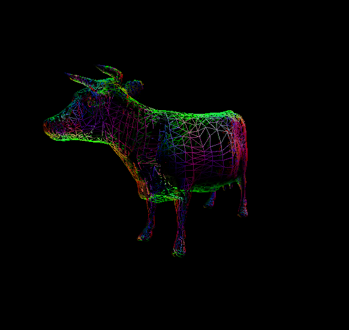

CUDA Rasterizer
===============

**University of Pennsylvania, CIS 565: GPU Programming and Architecture, Project 4**

* Ricky Rajani
* Tested on: Windows 7, i7-6700 @ 3.40GHz 16GB, NVIDIA Quadro K620 (Moore 100C Lab)

This project implements a simplified rasterized graphics pipeline, similar to the OpenGL pipeline, using CUDA.

### Core Features:
- Vertex assembly
- Vertex shading
- Primitive assembly
- Depth test
- Rasterization
- Race avoidance using atomic function
- Fragment shading with lambert lighting
- Framebuffer

### Extra Features:
- Support for rasterizing additional primitives: lines and points
- UV texture mapping with bilinear texture filtering and perspective correct texture coordinates

### Flags:
These flags can be found at the top of ```rasterize.cu```
- ```LIGHTING``` - Enables lambertian shading
- ```TEXTURE``` - Enables UV texture mapping, models are white by default
- ```BILINEAR``` - Enables bilinear texture filtering when ```TEXTURE``` is enabled
- ```PERSPECTIVE``` - Enables perspective correction when ```TEXTURE``` is enabled
- ```POINTS``` - Enables points instead of triangle primitives
- ```POINTCLOUD``` - Sparsity of points
- ```LINE``` - Enables lines instead of triangle primitives

# Samples

#### Demos of scenes using basic rasterization pipeline using Lambertian shading

Cow | Duck
:-------------------------------: | :-------------------------------:
 | 

Engine | Truck
:-------------------------------: | :-------------------------------:
 | 

### Demos of scenes using additional primitives
Duck | Cow
:-------------------------------: | :-------------------------------:
 | 

Duck | Cow | Truck
:-------------------------------: | :-------------------------------: | :-------------------------------:
 |  | 


The points have a step size of 50 so it is understandable that there is not as great a performance hit when using point primitives as it requires less iterations than using line primitives. 

#### Demos of scenes using UV texture mapping

Duck | Truck
:-------------------------------: | :-------------------------------:
 | 


Checkerboard | Checkerboard with Bilinear Filtering | Checkerboard with Perspective Correction
:-------------------------------: | :-------------------------------: | :-------------------------------:
 |  | 

Bilinear filtering is an antialiasing technique which creates smoother edges on the checkerboard compared to UV texture mapping without the filtering.  In this method the four nearest texels to the pixel center are sampled, and their colors are combined by weighted average according to distance. This removes the 'blockiness' seen during magnification, as there is now a smooth gradient of color change from one texel to the next, instead of an abrupt jump as the pixel center crosses the texel boundary. After profiling ```kernTextureMap``` when biliniear texture filterring is turned off and on, it seems that there is a performance hit. Without the filtering the kernel takes 0.88 ms for each iteration and 1.02 ms with filtering.

The perspective correction fixed the distortion that was occuring. As can be seen from the charts below, it greatly reduceds the FPS causing a non-trivial performance hit. Likewise, the same occurs with bilinear texture filtering, but the performance hit is not as great as perspective correction.

# Performance Analysis


It is interesting to note that the number of primitives in a scene does not have a direct effect on the time spent in each pipeline stage, specifically the rasterization stage which consumes the most amount of time. Examining the charts above with various scenes, the cow has over 5000 primitives and the rasterization stage takes a third of the total time, whereas the box only has 12 primitives but the rasterization stage takes up most of the total time. An explanation for this could be the size of the primitives. Each kernel iterates through an enture bounding box; therefore, if a primitive has a large size then its bounding box will be bigger and there is more work each kernel must do during each iteration. This may lead to a considerable performance hit. 

*CMakeLists modified to include 'common.h' for recording performance time

### Credits

* [tinygltfloader](https://github.com/syoyo/tinygltfloader) by [@soyoyo](https://github.com/syoyo)
* [glTF Sample Models](https://github.com/KhronosGroup/glTF/blob/master/sampleModels/README.md)
* [Bilineary texture filtering](https://en.wikipedia.org/wiki/Bilinear_interpolation)
* [Perspective correctness](https://en.wikipedia.org/wiki/Texture_mapping#Perspective_correctness)
