CUDA Rasterizer
===============

**University of Pennsylvania, CIS 565: GPU Programming and Architecture, Project 4**

* Ricky Rajani
* Tested on: Windows 7, i7-6700 @ 3.40GHz 16GB, NVIDIA Quadro K620 (Moore 100C Lab)

This project implements a simplified rasterized graphics pipeline, similar to the OpenGL pipeline, using CUDA.

### Core Features:
- Vertex assembly
- Vertex shading
- Primitive assembly
- Depth test
- Rasterization
- Race avoidance using atomic function
- Fragment shading with lambert lighting
- Framebuffer

### Extra Features:
- Support for rasterizing additional primitives: lines and points
- UV texture mapping with bilinear texture filtering and perspective correct texture coordinates

# Samples

#### Demos of scenes using basic rasterization pipeline using Lambert lighting

Cow | Duck
:-------------------------------: | :-------------------------------:
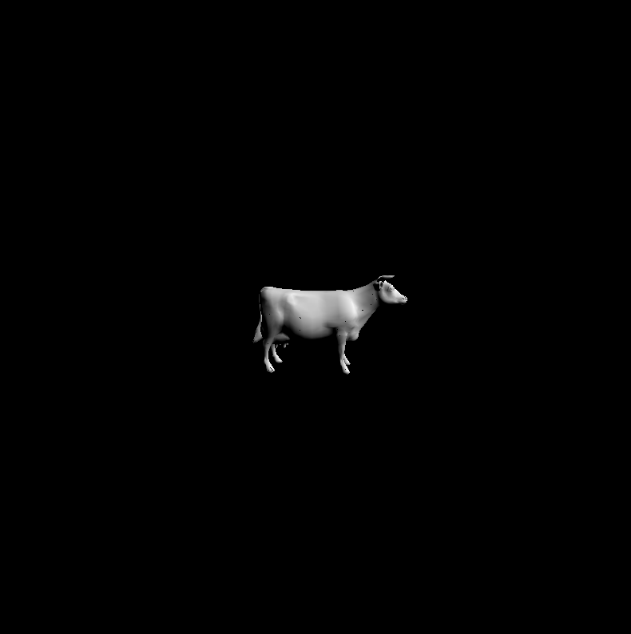 | 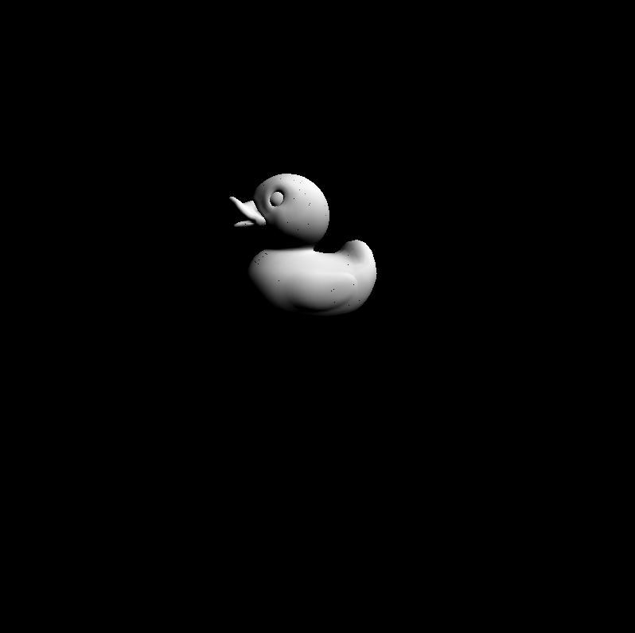

Engine | Truck
:-------------------------------: | :-------------------------------:
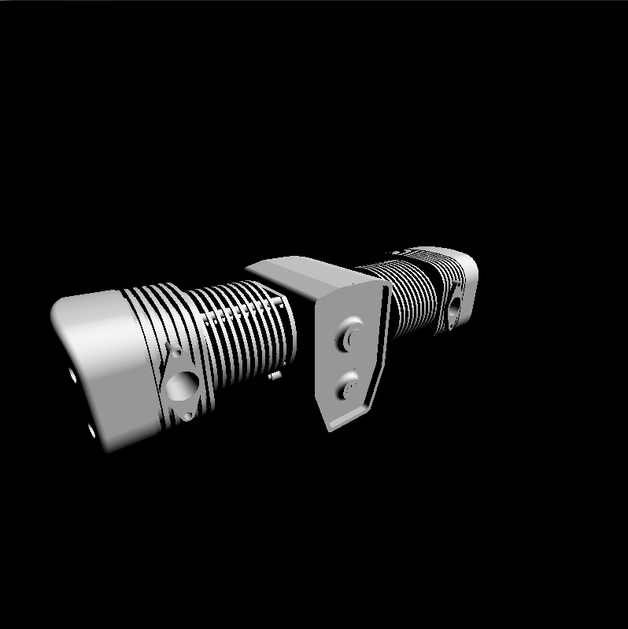 | 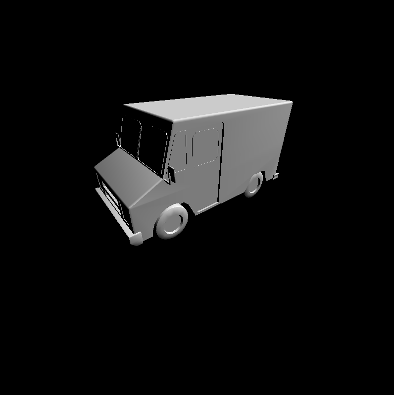

### Demos of scenes using additional primitives
Duck

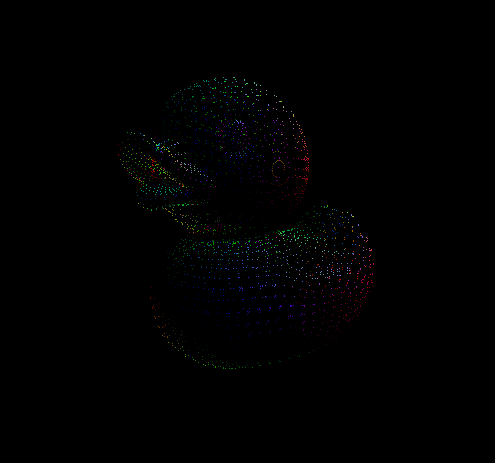

Cow

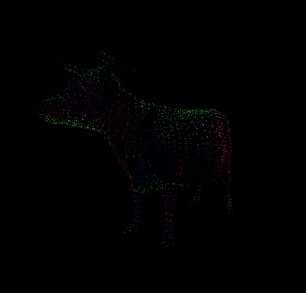

Duck | Truck
:-------------------------------: | :-------------------------------:
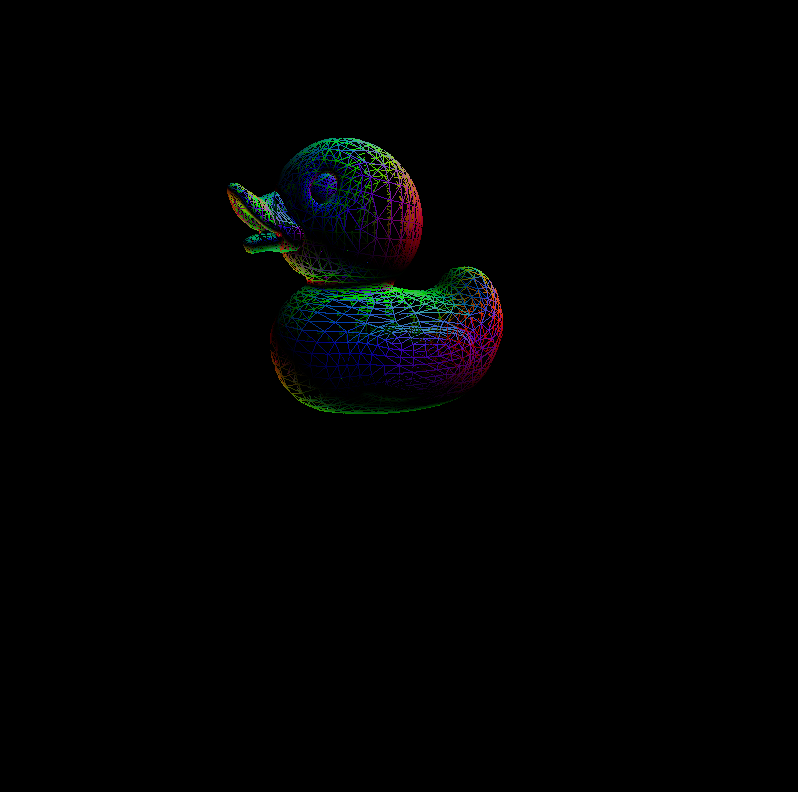 | 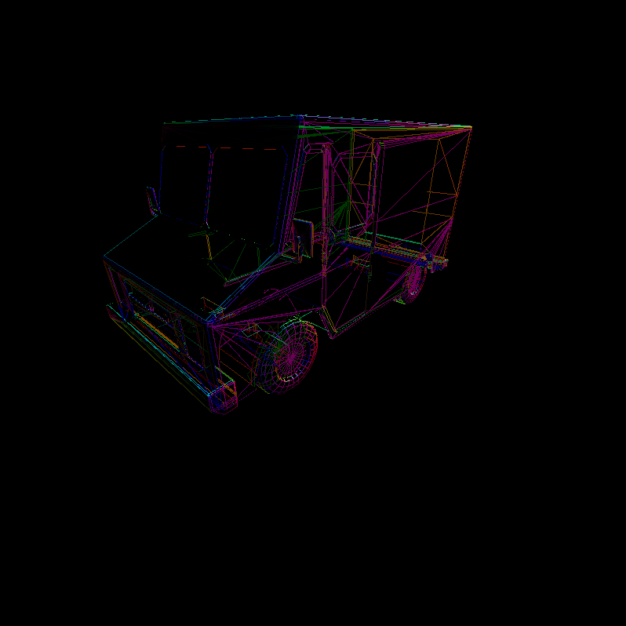

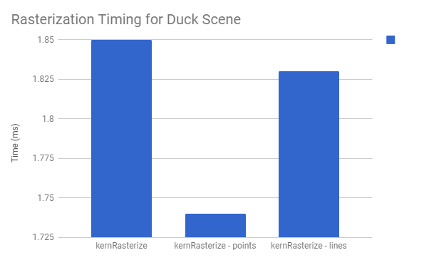

// TODO: add performance analysis

#### Demos of scenes using UV texture mapping

Duck | Truck
:-------------------------------: | :-------------------------------:
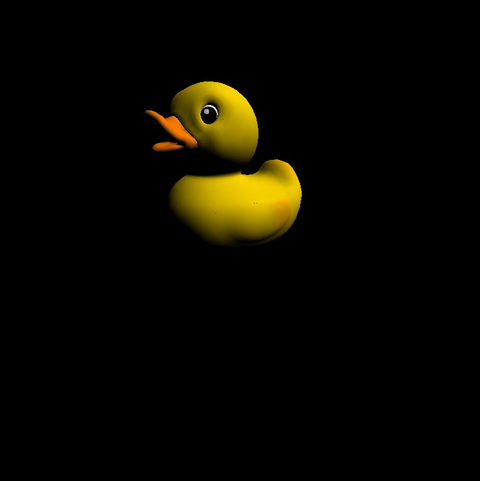 | 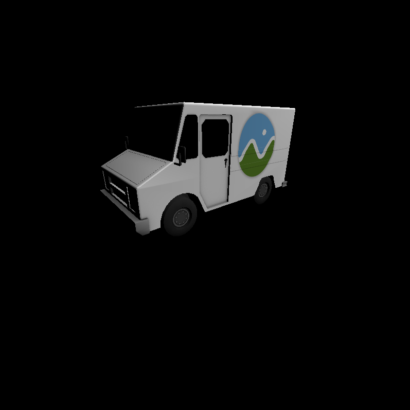

Checkerboard | Checkerboard with Bilinear Filtering | Checkerboard with Perspective Correction
:-------------------------------: | :-------------------------------: | :-------------------------------:
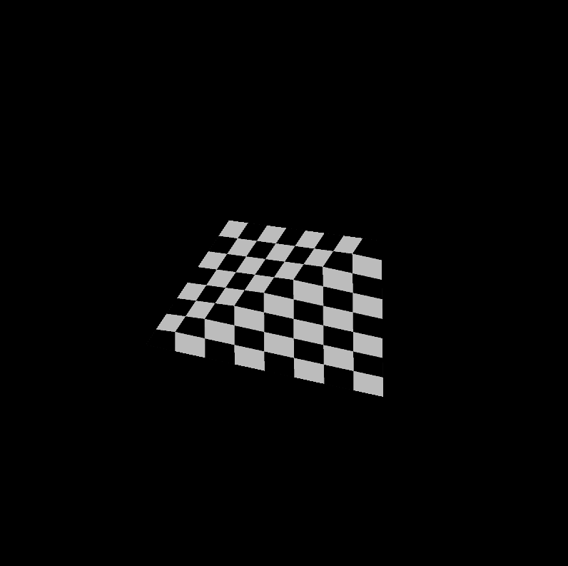 | 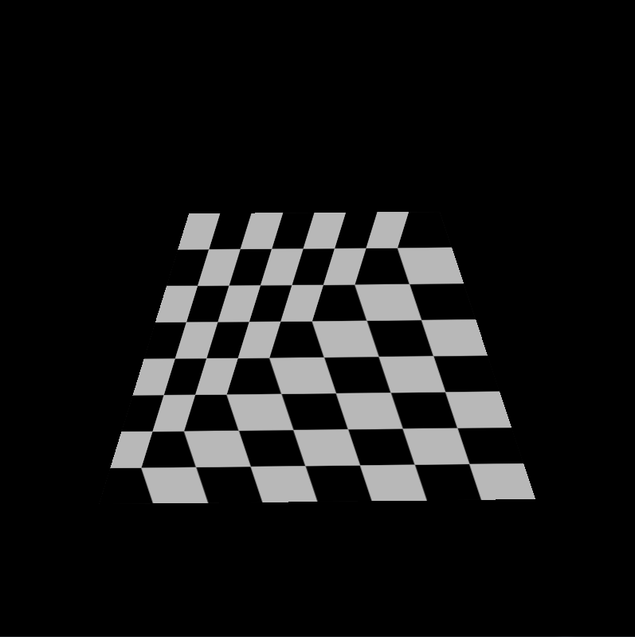 | 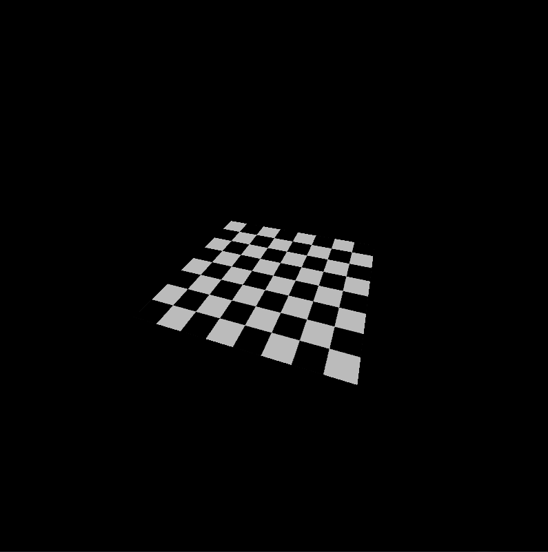

// TODO: Add performance analysis

Timing for Checkerboard	
kernTextureMap	0.88
kernTextureMap with Bilinear Texture Filtering	1.02
kernRasterize	90
kernRasterize with Perspective Correction	66

# Performance Analysis

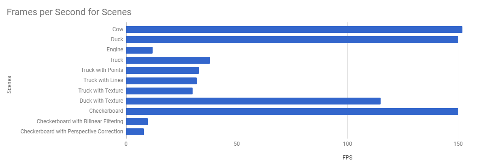

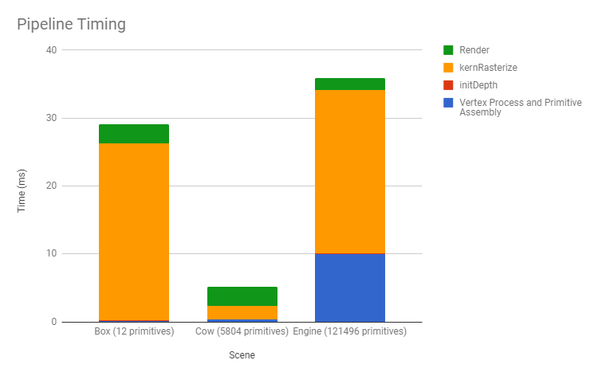

*CMakeLists modified to include 'common.h' for recording performance time

### Credits

* [tinygltfloader](https://github.com/syoyo/tinygltfloader) by [@soyoyo](https://github.com/syoyo)
* [glTF Sample Models](https://github.com/KhronosGroup/glTF/blob/master/sampleModels/README.md)
